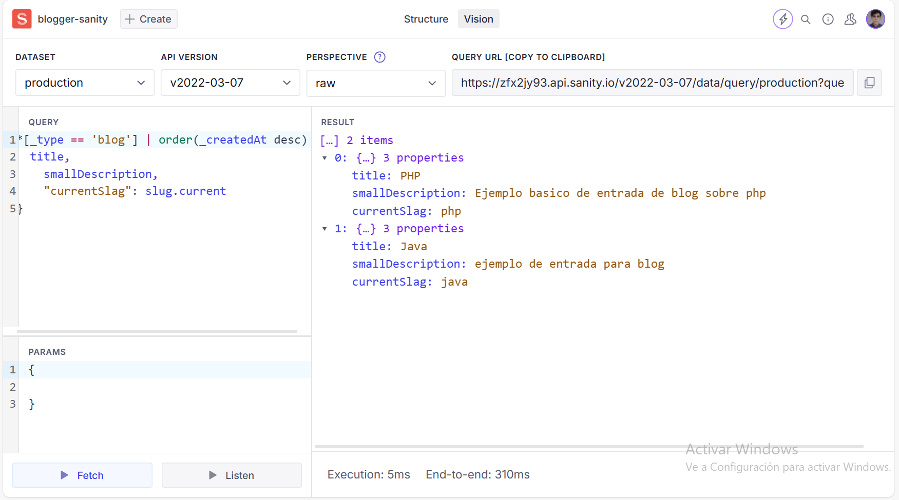

# Queries en Sanity - GROQ

+ Documentación Oficial [GROQ Query Language - GraphQL Alternative](https://www.sanity.io/docs/groq).

Las queries en Sanity son utilizadas para obtener datos de la base de datos y mostrarlos en la interfaz de usuario. Sanity es un sistema de gestión de contenido (CMS) que permite a los desarrolladores crear y administrar contenido de manera flexible.

Una query en Sanity se construye utilizando el lenguaje de consulta GROQ (Graph-Relational Object Queries). GROQ es un lenguaje de consulta desarrollado específicamente para Sanity y está diseñado para ser intuitivo y poderoso.

Las queries en Sanity se utilizan para recuperar datos de los documentos almacenados en la base de datos. Estos documentos pueden contener cualquier tipo de información, como texto, imágenes, videos, etc. Las queries permiten especificar qué datos se desean obtener y cómo se deben filtrar y ordenar.

Algunos conceptos clave relacionados con las queries en Sanity son:

1. **Tipos de documentos**: En Sanity, los datos se organizan en tipos de documentos. Cada tipo de documento define la estructura y los campos de los datos que se pueden almacenar. Las queries se utilizan para recuperar datos de un tipo de documento específico.

2. **Selección de campos**: Las queries permiten especificar qué campos se desean obtener de los documentos. Esto permite obtener solo la información necesaria y evitar la sobrecarga de datos.

3. **Filtrado**: Las queries en Sanity también permiten filtrar los resultados en función de ciertos criterios. Esto se logra utilizando operadores de comparación y lógicos para especificar las condiciones de filtrado.

4. **Ordenamiento**: Es posible ordenar los resultados de una query en Sanity utilizando uno o más campos como criterio de ordenamiento. Esto permite mostrar los datos en un orden específico, como ascendente o descendente.

5. **Paginación**: En caso de que los resultados de una query sean demasiado grandes para mostrarse todos a la vez, es posible utilizar la paginación para dividir los resultados en páginas más pequeñas.

Es importante destacar que las queries en Sanity son ejecutadas en el lado del servidor, lo que significa que los datos se obtienen directamente de la base de datos. Esto garantiza un rendimiento óptimo y una respuesta rápida.

En resumen, las queries en Sanity son utilizadas para obtener datos de la base de datos y mostrarlos en la interfaz de usuario. Estas queries se construyen utilizando el lenguaje de consulta GROQ y permiten seleccionar campos, filtrar y ordenar los resultados. Las queries en Sanity son una herramienta poderosa para acceder y manipular datos de manera eficiente y flexible.